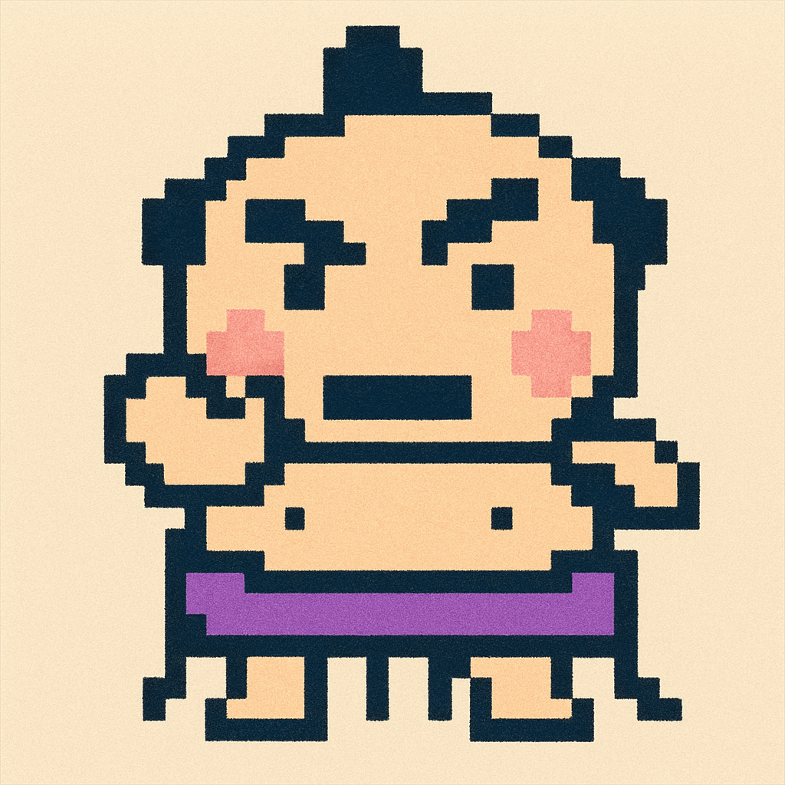
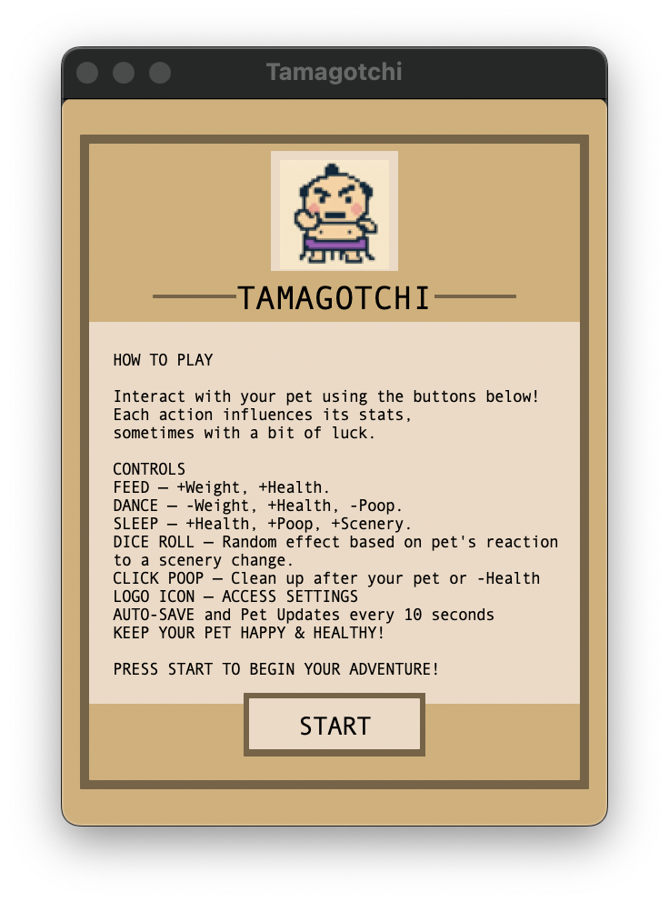
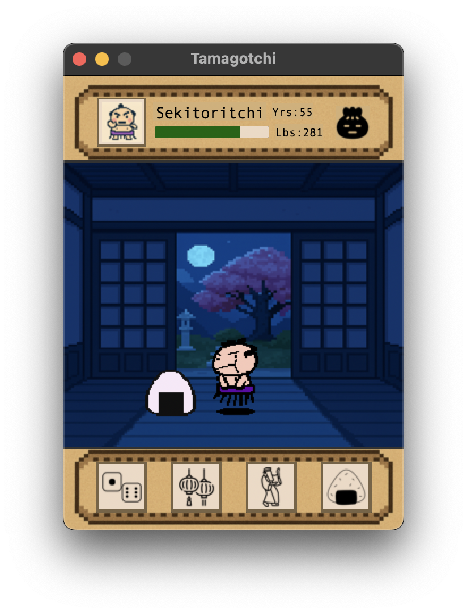
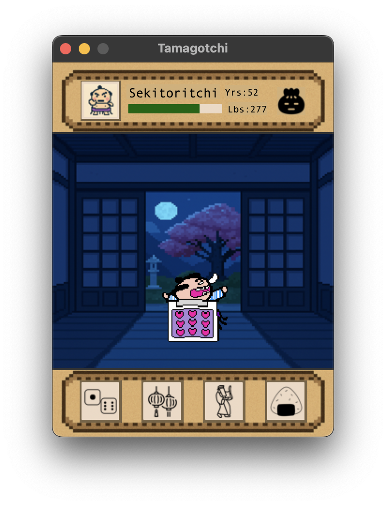
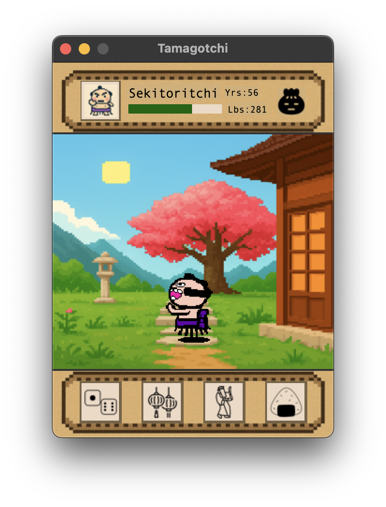
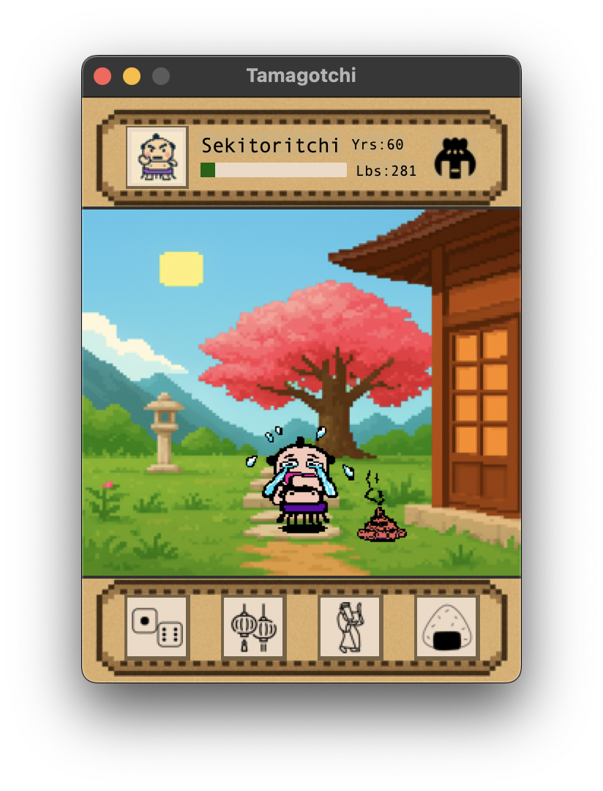
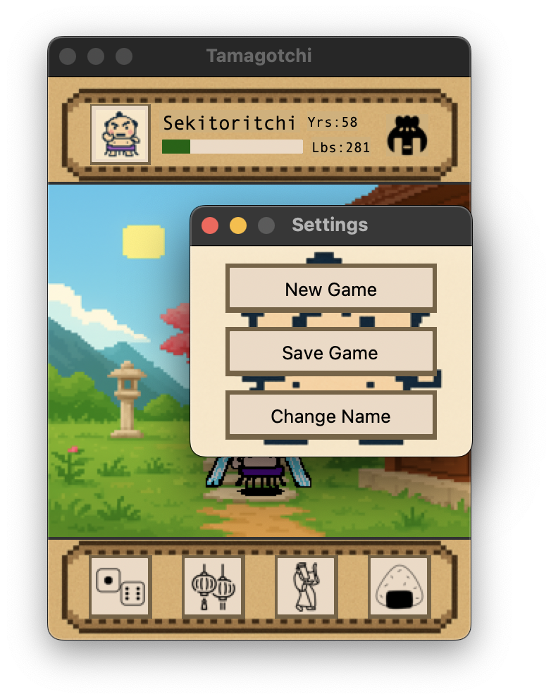

# Python Tamagotchi

A modern implementation of the classic Tamagotchi virtual pet game, built with Python and CustomTkinter. This project combines nostalgic gameplay with modern programming practices and a polished user interface.

<div align="center">
  
</div>

## Features

- 🐱 **Pet Care System**: Manage your pet's health, weight, and age
- 🎮 **Interactive Actions**: Feed, dance, sleep, and random events
- 🎨 **Rich Animations**: Smooth sprite animations and dynamic backgrounds
- 💾 **Auto-Save**: Automatic game state saving every 15 seconds
- 🎯 **Mood System**: Pet's mood changes based on health and interactions
- 🌈 **Dynamic Backgrounds**: 8 different backgrounds with day/night cycles

## Screenshots

<div align="center">
  
  
  <br>
  
  
  <br>
  
  
  <br>
  
</div>

## Requirements

- Python 3.8+
- CustomTkinter
- Pillow (PIL)

## Installation

1. Clone the repository:
```bash
git clone https://github.com/yourusername/python-tamagotchi.git
cd python-tamagotchi
```

2. Install required packages:
```bash
pip install customtkinter pillow
```

## How to Play

1. Run the game:
```bash
python Run.py
```

2. Game Controls:
   - **Feed**: Increases weight and health
   - **Dance**: Reduces weight, increases health, decreases poop level
   - **Sleep**: Increases health and poop level, changes background to night
   - **Dice Roll**: Random events with different effects
   - **Click Poop**: Clean up after your pet
   - **Logo Icon**: Access settings

3. Keep your pet healthy by:
   - Maintaining good health levels
   - Managing weight
   - Cleaning up poop
   - Regular interaction

## Project Structure

```
python-tamagotchi/
│
├── Run.py              # Game entry point
├── Model.py           # Game state and logic
├── View.py            # UI implementation
├── Controller.py      # Game controller
├── Animate.py         # Sprite animation system
├── Assets/            # Game assets
│   ├── sprite.png     # Sprite sheet
│   ├── Weather/       # Background images
│   └── Buttons/       # UI button images
└── save_file.json     # Game save data
```

## Acknowledgments

- Inspired by the original Tamagotchi virtual pet
- Built with CustomTkinter for modern UI elements
- Uses the Observer pattern for efficient updates